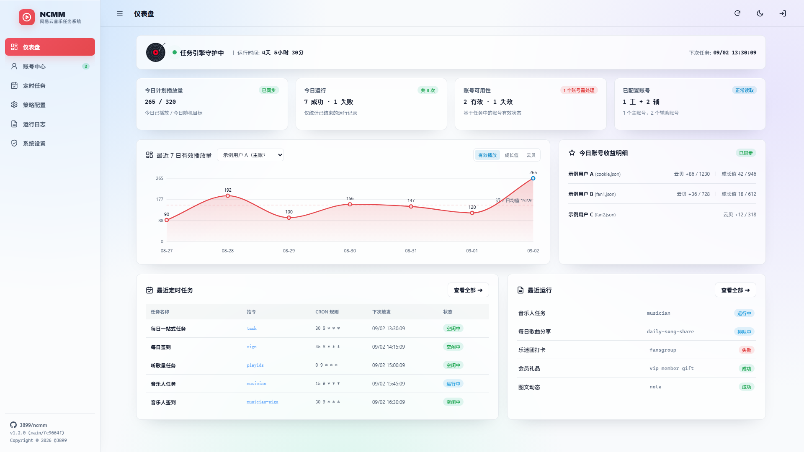

<a href="https://github.com/3899/ncmm">
  
</a>

<div align="center">
  <br/>

  <div>
    <a href="./LICENSE">
      
    </a>
    <a href="https://github.com/3899/ncmm/releases">
      
    </a>
    <a href="https://github.com/3899/ncmm/releases">
        
    </a>
    <a href="https://github.com/3899/ncmm/pkgs/container/ncmm">
      
    </a>
    <a href="https://github.com/3899/ncmm/pkgs/container/ncmm">
      
    </a>
  </div>
</div>

# 🎵 ncmm

`ncmm` 是一个基于 Go 开发的网易云音乐一站式任务管理工具，同时提供命令行与 WebUI，面向音乐人、黑胶 VIP 和普通账号使用。

项目支持日常签到、云贝与成长值任务、音乐人任务、歌曲播放、图文动态、每日推歌、会员礼品和乐迷团打卡，并提供多账号管理、定时调度、收益统计、运行日志与失败通知。

---

## 🚀 核心功能

- **WebUI 管理工作台**：统一管理账号、任务、配置、日志和系统状态，支持明暗主题。
- **多账号登录与隔离**：支持二维码、Cookie、手机号和 CookieCloud 登录。
- **任务自动化**：覆盖签到、播放、音乐人、图文动态、每日推歌、会员礼品和乐迷团任务。
- **数据统计**：展示云贝、VIP 成长值、账号状态和最近 7 日有效播放量。
- **定时调度与通知**：任务可独立设置 cron，并支持多种失败通知通道。
- **安全与数据管理**：提供密码保护、会话安全、配置备份和 `--home` 工作区隔离。

---

## ⚡ 快速上手

### 启动 WebUI（推荐）

```bash
./ncmm --home ./run web
```

启动后访问 [http://127.0.0.1:3899](http://127.0.0.1:3899)，首次打开按页面提示设置管理员密码。详细操作见 [WebUI 使用说明](docs/webui.md)。

### 使用命令行

```bash
./ncmm --home ./run login cookie 'MUSIC_U=你的Cookie值;' -m
./ncmm --home ./run task
```

普通任务命令不会启动 WebUI。命令参数、独立任务和登录方式见 [命令行使用说明](docs/cli.md)。

---

## 🖼️ WebUI 预览



[查看完整功能说明与界面预览](docs/webui.md)

---

## 📚 详细文档

为了获得更好的阅读体验，本项目的详细使用手册已拆分为以下子文档：

* 🖥️ [WebUI 使用说明](docs/webui.md) — 启动方式、账号管理、定时任务、安全设置和完整界面预览。
* ⚙️ [配置文件详解](docs/configuration.md) — 了解 `config.yaml` 详细配置字段及各项任务开关说明。
* 🔔 [失败通知](docs/notify.md) — 运行失败汇总推送（Webhook / Bark / TG / 钉钉等，通道配置独立 `notify.yaml`）。
* 🪟 [Windows 运行指南](docs/windows.md) — 了解 Windows 前台运行、无窗口一键启动和停止方式。
* 🐳 [Docker 部署指南](docs/docker.md) — 了解如何通过 Docker/Docker Compose 一键部署并配合定时任务运行。
* 🐲 [青龙 / 呆呆面板部署指南](docs/qinglong.md) — 了解如何在青龙面板（Qinglong）与呆呆面板（Dumb-Panel）中订阅部署并配置自动化打卡任务。
* 📖 [命令行使用说明](docs/cli.md) — 查看完整的命令树、通用参数以及所有子命令的使用实例。
* 👥 [多账号隔离最佳实践](docs/multi-accounts.md) — 学习如何使用 `--home` 管理多个粉丝账号，实现全自动接力刷量。
* 📝 [版本更新记录](docs/changelog.md) — 查看历史版本的新增功能、架构优化与 Bug 修复记录。

---

## ⚠️ 免责声明

本项目仅供学术研究和 Golang 学习探讨之用，请勿用于任何商业用途或违反网易云音乐服务条款的行为。对于使用本项目带来的任何账号封禁、数据丢失等不良后果，由使用者自行承担，本项目不提供任何连带保证。

---

## 🎖️ 鸣谢

### 👥 贡献者

感谢大家为 ncmm 做出的宝贵贡献！如果你也希望为 ncmm 做出贡献，请查阅 [贡献指南](./.github/CONTRIBUTING.md)。

<a href="https://github.com/3899/ncmm/graphs/contributors">
  
</a>


### 📦 参考项目
| 项目 | 说明 |
| :--- | :--- |
| [chaunsin/netease-cloud-music](https://github.com/chaunsin/netease-cloud-music) | 网易云音乐 API |
| [crossgg/netease-cloud-music](https://github.com/crossgg/netease-cloud-music) | 网易云音乐人任务 |
| [NeteaseCloudMusicApiEnhanced/api-enhanced](https://github.com/NeteaseCloudMusicApiEnhanced/api-enhanced) | 网易云音乐API接口 |
| 所有依赖的开源项目 | |
