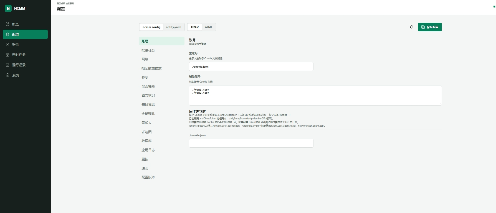

<a href="https://github.com/3899/ncmm">
  
</a>

<div align="center">
  <br/>

  <div>
    <a href="./LICENSE">
      
    </a>
    <a href="https://github.com/3899/ncmm/releases">
      
    </a>
    <a href="https://github.com/3899/ncmm/releases">
        
    </a>
    <a href="https://github.com/3899/ncmm/pkgs/container/ncmm">
      
    </a>
    <a href="https://github.com/3899/ncmm/pkgs/container/ncmm">
      
    </a>
  </div>
</div>

# 🎵 ncmm

`ncmm` 是一个专门为**网易云音乐人**设计的命令行助手工具，基于 Go 语言开发。

本项目旨在帮助网易云音乐人 / 普通账号一键完成日常签到、自动执行黑胶 VIP 进阶任务（包括图文笔记自动发布与秒删、多粉丝号接力刷播放量等），帮助音乐人轻松获取并维持黑胶会员权益。工具严格遵循防风控设计，支持多账号安全隔离、播放量分摊回退、日推歌曲混听干扰以及本人播放拦截等安全策略。

---

## 🚀 核心功能

1. **🔑 账号登录管理 (`ncmm login`)**：支持扫码登录、Cookie 导入与 CookieCloud 同步。
2. **🎵 模拟歌曲播放 (`ncmm playids`)**：真实模拟音频流量下载、播放时长等待以及歌曲播放动作上报。
3. **📊 每日播放目标控制**：支持随机每日播放上限、限额自增与达标退出机制，防范防刷检测。
4. **📅 每日任务一键签到 (`ncmm sign`)**：一键完成黑胶 VIP 签到、云贝日常任务做任务（浏览、点赞、小众听歌等）。
5. **🎖️ 音乐人及黑胶进阶任务 (`ncmm musician`)**：日常云豆签到领取、VIP 图文发布及多账号接力刷播放量任务。
6. **🎧 乐迷团任务 (`ncmm fansgroup`)**：一键打卡已加入乐迷团的日常任务，包含播放、发布笔记、点赞分享等。
7. **📝 笔记发布独立命令 (`ncmm note`)**：单独发布图文动态，并支持发布后自动秒删，维持个人主页整洁。
8. **📢 每日歌曲分享与抽奖 (`ncmm daily-song-share`)**：自动选择歌曲（固定或随机）发布到移动端动态，支持挂载专属活动话题，并在分享成功后自动参与活动抽奖，支持发布后自动删除动态以保持主页整洁。
9. **🎁 黑胶会员赠送与领取 (`ncmm vip-member-gift`)**：自动将账号内多余的免费黑胶会员天数生成赠送 Token 并上报云端；同时支持从云端拉取可用 Token 自动为自己领取会员天数，支持私有化云服务部署。
10. **📁 灵活的 `--home` 隔离机制**：多账号下配置、Cookie、数据库、日志自动隔离，安全无干扰。
11. **🖥️ 管理服务 (`ncmm web`)**：可视化编辑 `config.yaml` / `notify.yaml`，支持 Cookie 和二维码登录、自动调度、任务与运行日志管理；管理端使用 PBKDF2 管理员密码、HttpOnly Session、CSRF 防护和登录限速，Docker 镜像默认在 `3899` 端口启用。

---

## ⚡ 快速上手

### 1. 账号登录
推荐使用 Cookie 导入：
```bash
# 导入主账号 Cookie 并标记为 -m (Main)
./ncmm login cookie '你的MUSIC_U_cookie串' -m
```

### 2. 一键运行批量任务
运行以下命令，即可在默认工作目录下根据配置文件规则自动执行日常一键打卡签到任务：
```bash
./ncmm task
```
也可以启动完整管理服务，然后通过 http://127.0.0.1:3899 打开：
```bash
./ncmm web
```

`ncmm web` 默认包含 WebUI 与内置定时调度。新安装不会自动创建有副作用的任务；每条定时规则通过自身开关独立启停，并按各自 cron 错开运行。青龙、系统 cron 等外部调度场景只需定期执行 `ncmm task`，不要同时常驻 WebUI 调度器。

可选参数：

`--listen 0.0.0.0:3899` #监听所有网卡；默认仅监听 `127.0.0.1:3899`

`--secure-cookie` #通过 HTTPS 反向代理访问时，为登录 Cookie 启用 Secure 属性

首次打开 WebUI 时直接设置并确认管理员密码。密码只保存加盐 hash，浏览器凭据只存在于 HttpOnly Cookie。v1.2.0 不迁移 v1.1.x 的管理令牌；升级后如没有 `webui-auth.json`，重新设置密码即可，原有任务配置、Cookie、数据库、调度规则和运行记录不会被修改。忘记密码时先停止 WebUI，再执行 `ncmm auth reset-password`；完整说明见[命令行使用说明](docs/cli.md)。

旧版 `webui.yaml` 首次升级时会安全迁移：原先显式使用 `--scheduler` 的实例保留每条任务的启用状态，其他旧实例默认逐条禁用历史任务，防止升级后突然运行。迁移完成后只由每条任务自身的启用状态控制。

预览图：




*(更多有关多账号隔离管理和 Docker 自动部署，请参阅下方详细文档。)*

---

## 📚 详细文档

为了获得更好的阅读体验，本项目的详细使用手册已拆分为以下子文档：

* ⚙️ [配置文件详解](docs/configuration.md) — 了解 `config.yaml` 详细配置字段及各项任务开关说明。
* 🔔 [失败通知](docs/notify.md) — 运行失败汇总推送（Webhook / Bark / TG / 钉钉等，通道配置独立 `notify.yaml`）。
* 🪟 [Windows 运行指南](docs/windows.md) — 了解 Windows 前台运行、无窗口一键启动和停止方式。
* 🐳 [Docker 部署指南](docs/docker.md) — 了解如何通过 Docker/Docker Compose 一键部署并配合定时任务运行。
* 🐲 [青龙 / 呆呆面板部署指南](docs/qinglong.md) — 了解如何在青龙面板（Qinglong）与呆呆面板（Dumb-Panel）中订阅部署并配置自动化打卡任务。
* 📖 [命令行使用说明](docs/cli.md) — 查看完整的命令树、通用参数以及所有子命令的使用实例。
* 👥 [多账号隔离最佳实践](docs/multi-accounts.md) — 学习如何使用 `--home` 管理多个粉丝账号，实现全自动接力刷量。
* 📝 [版本更新记录](docs/changelog.md) — 查看历史版本的新增功能、架构优化与 Bug 修复记录。

---

## ⚠️ 免责声明

本项目仅供学术研究和 Golang 学习探讨之用，请勿用于任何商业用途或违反网易云音乐服务条款的行为。对于使用本项目带来的任何账号封禁、数据丢失等不良后果，由使用者自行承担，本项目不提供任何连带保证。

---

## 🎖️ 鸣谢

### 👥 贡献者

感谢大家为 ncmm 做出的宝贵贡献！如果你也希望为 ncmm 做出贡献，请查阅 [贡献指南](./.github/CONTRIBUTING.md)。

<a href="https://github.com/3899/ncmm/graphs/contributors">
  
</a>


### 📦 参考项目
| 项目 | 说明 |
| :--- | :--- |
| [chaunsin/netease-cloud-music](https://github.com/chaunsin/netease-cloud-music) | 网易云音乐 API |
| [crossgg/netease-cloud-music](https://github.com/crossgg/netease-cloud-music) | 网易云音乐人任务 |
| [NeteaseCloudMusicApiEnhanced/api-enhanced](https://github.com/NeteaseCloudMusicApiEnhanced/api-enhanced) | 网易云音乐API接口 |
| 所有依赖的开源项目 | |
