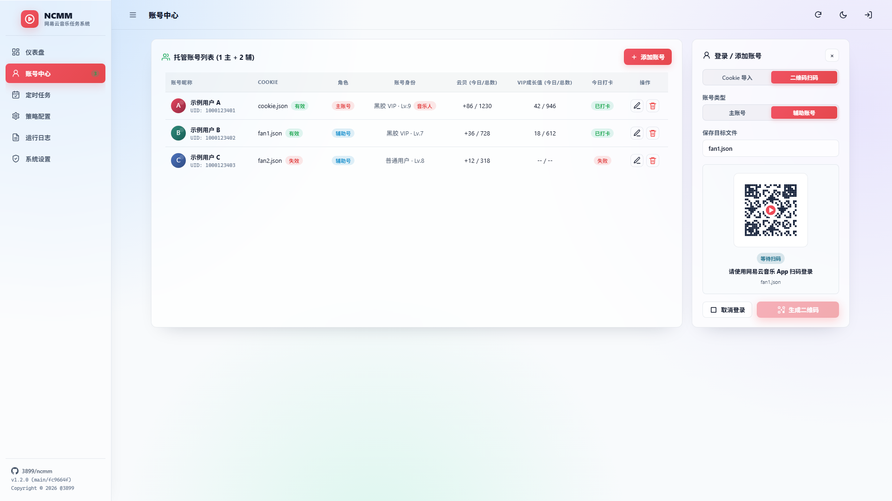
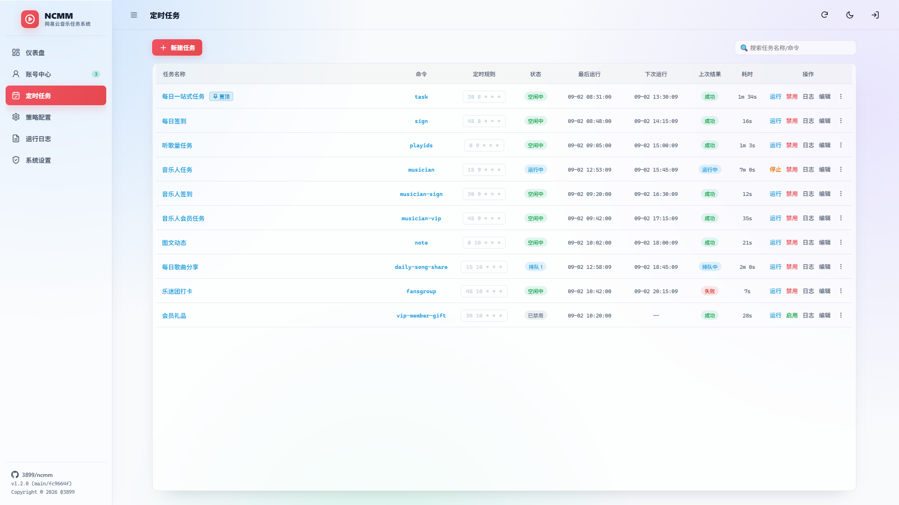
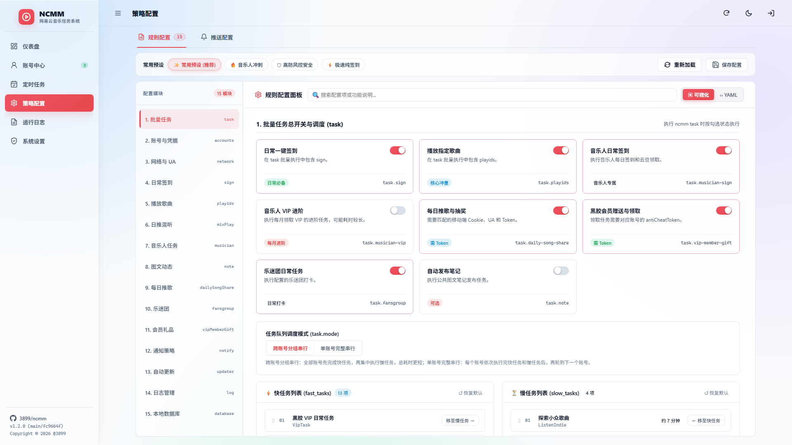
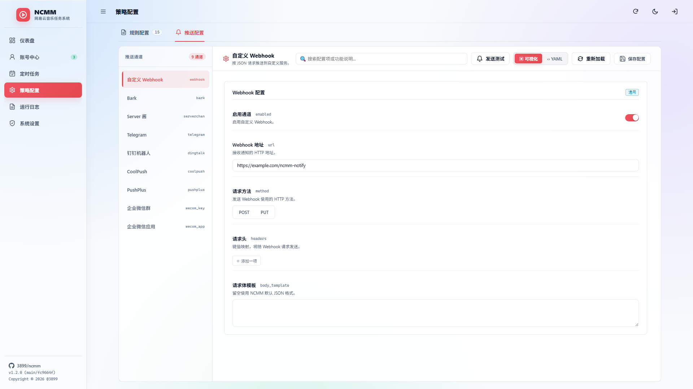
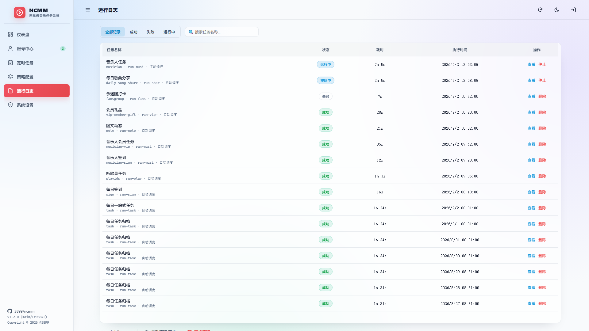
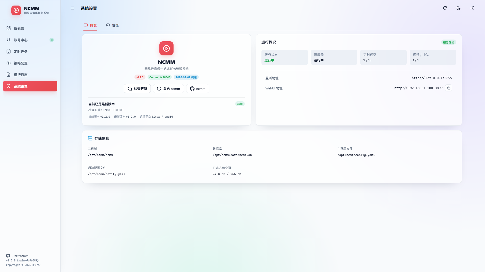
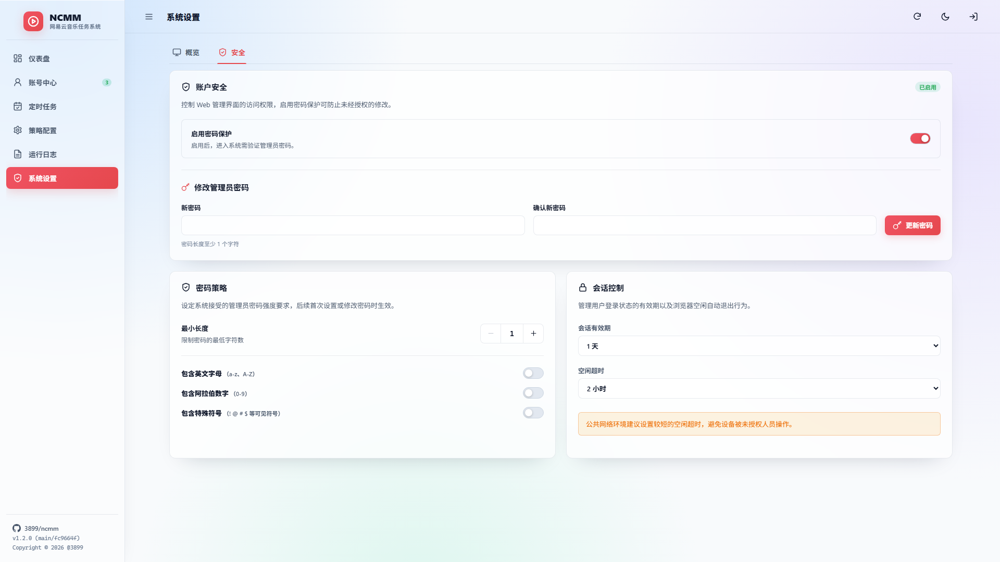

# 🖥️ WebUI 使用说明

NCMM WebUI 是随 `ncmm web` 启动的管理工作台，包含仪表盘、账号中心、定时任务、策略配置、运行日志和系统设置。它适合在本机、服务器或 Docker 中常驻运行；只使用命令行、系统 cron 或青龙面板时不需要启动 WebUI。

---

## 1. 启动与访问

### Linux / macOS

```bash
./ncmm --home ./run web
```

### Windows PowerShell

```powershell
.\ncmm.exe --home .\run web
```

默认访问地址为 [http://127.0.0.1:3899](http://127.0.0.1:3899)。`--home` 指定的目录用于保存配置、Cookie、数据库、WebUI 认证、定时规则和运行日志，建议始终显式设置。

常用参数：

| 参数 | 说明 |
| :--- | :--- |
| `--listen 0.0.0.0:3899` | 监听所有网卡，允许局域网或反向代理访问 |
| `--web-config <路径>` | 指定 WebUI 设置文件，默认使用 `--home/webui.yaml` |
| `--secure-cookie` | 为 Session Cookie 增加 `Secure`，HTTPS 反向代理场景启用 |
| `--background` | Windows 下无控制台窗口运行 |

> [!IMPORTANT]
> 默认仅监听 `127.0.0.1`。监听 `0.0.0.0` 前，应先完成管理员密码设置，并配置防火墙或 HTTPS 反向代理。不要将未初始化的管理页面直接暴露到公网。

同一规范化 `--home` 同时只允许一个 WebUI 实例运行。需要并行运行多个实例时，必须分别使用不同的 home 和监听端口。

---

## 2. WebUI 与外部调度

`ncmm web` 会同时启动 WebUI 和内置调度器，但启动或重载时不会立即批量运行任务。新工作区不会自动创建有副作用的定时任务，每条规则由自己的启用状态和 cron 时间控制。

| 使用场景 | 建议方式 |
| :--- | :--- |
| 本机或服务器常驻管理 | 运行 `ncmm web`，使用 WebUI 内置调度器 |
| Docker 部署 | 镜像默认运行 `ncmm web` 并开放 `3899` 端口 |
| 青龙、系统 cron、其他面板 | 定期执行 `ncmm task`，无需启动 WebUI |

同一个工作目录不要同时使用外部调度和 WebUI 内置调度器，以免任务被重复触发。普通的 `task`、`sign`、`playids` 等命令不会加载或启动 WebUI。

Docker 和面板部署分别参阅 [Docker 部署指南](docker.md) 与 [青龙 / 呆呆面板部署指南](qinglong.md)。

---

## 3. 首次登录与安全

首次启动且 `--home/webui-auth.json` 尚未配置时，页面会要求设置管理员密码。默认策略如下：

- 密码保护默认启用；
- 最小长度默认为 1，最大长度为 64；
- 默认不强制包含字母、数字或符号；
- 密码仅允许可见 ASCII 字符，不允许空格或中文；
- 可在“系统设置 → 安全”中提高密码要求、调整会话时长或停用密码保护。

密码只以 PBKDF2 加盐哈希保存。浏览器使用 HttpOnly、SameSite=Strict Session Cookie，不会把密码或 Session Token 写入 Web Storage。通过公网或共享网络访问时，建议保留密码保护并设置强密码。

忘记密码时，先停止对应 home 的 WebUI，再执行：

```bash
ncmm --home ./run auth reset-password
```

也可以清除认证状态并重新进入首次设置：

```bash
ncmm --home ./run auth clear --yes
```

这些命令只操作 `webui-auth.json`，不会修改业务配置、Cookie、数据库、定时规则或运行记录。更多恢复参数见 [命令行使用说明](cli.md)。

---

## 4. 页面与地址

登录后可以通过侧栏切换模块，也可以直接访问对应地址：

| 模块 | 地址 | 主要用途 |
| :--- | :--- | :--- |
| 仪表盘 | `/` | 收益、账号状态、有效播放趋势和最近任务 |
| 账号中心 | `/account` | Cookie / 二维码登录、账号信息与收益状态 |
| 定时任务 | `/task` | 创建、启停、运行和查看任务日志 |
| 策略配置 | `/config` | 编辑业务规则与推送通道 |
| 运行日志 | `/logs` | 查看、删除和清理历史运行记录 |
| 系统设置 | `/system` | 运行状态、存储位置、更新和安全设置 |

例如本机默认地址为 `http://127.0.0.1:3899/account`。

---

## 5. 账号中心

点击“添加账号”后可选择 Cookie 导入或二维码扫码。新账号默认按辅助账号添加，需要主账号时可在添加页面切换账号类型。

登录成功后，WebUI 会保存 Cookie 文件并登记到 `config.yaml`。账号列表会在登录或任务执行后同步真实昵称、头像、Cookie 状态、VIP / 音乐人身份、云贝和成长值。编辑账号时 Cookie 文件名只读，避免误改保存路径。

Cookie、手机号和 CookieCloud 的完整参数说明见 [命令行使用说明](cli.md)。

---

## 6. 定时任务

每条任务可单独配置名称、命令、cron、启用状态和冲突策略。当前支持的独立任务命令如下：

| 命令 | 用途 |
| :--- | :--- |
| `task` | 按业务配置执行批量任务 |
| `sign` | 每日签到、云贝任务及收益同步 |
| `playids` | 播放指定歌曲并控制每日目标 |
| `musician` | 兼容执行音乐人日常及进阶任务 |
| `musician-sign` | 音乐人签到与云豆领取 |
| `musician-vip` | 音乐人 VIP 进阶任务 |
| `note` | 发布图文动态 |
| `daily-song-share` | 每日歌曲分享、活动登记与抽奖 |
| `vip-member-gift` | 黑胶会员礼品赠送与领取 |
| `fansgroup` | 乐迷团日常打卡 |

冲突策略说明：

- `skip`：同一规则已有活动运行时跳过本次触发；
- `allow`：允许重复触发进入队列，但不会绕过账号或数据库资源锁强制并行。

运行中的任务可以停止；已完成任务可以直接弹窗查看日志。禁用规则不会停止已经开始运行的实例。

---

## 7. 策略配置

“规则配置”通过结构化 Schema 展示 `config.yaml`，支持常用预设、配置搜索和卡片式控件；“推送配置”用于编辑 `notify.yaml`，并可向当前通道发送测试消息。

两个配置页都保留 YAML 视图，提供行号、语法高亮和格式校验。保存前会检测配置版本冲突，避免多个页面或 CLI 同时修改时覆盖新内容，并在成功保存时维护 `.bak` 备份。

各字段含义见 [配置文件详解](configuration.md)，推送通道参数见 [失败通知](notify.md)。

---

## 8. 运行日志与系统设置

运行日志支持按状态筛选、查看单次日志、停止活动任务、删除记录、自动清理和按条件高级清理。清理策略可以按保留天数和日志总容量组合使用。

系统设置包括：

- 服务、调度器、定时规则及运行队列状态；
- WebUI 地址和配置、数据库、日志等存储路径；
- 当前版本、Commit、构建时间和版本检查；
- 管理员密码、密码策略及会话控制。

---

## 9. 升级说明

v1.2.0 使用全新的 WebUI 认证状态，不迁移 v1.1.x 管理令牌。升级后如果没有 `webui-auth.json`，重新设置管理员密码即可，原有任务配置、Cookie、数据库、调度规则和运行记录都会保留。

旧版 `webui.yaml` 首次加载时会安全迁移。历史启动命令显式使用 `--scheduler` 的实例保留原任务启用状态，其他旧实例默认禁用历史任务，防止升级后意外执行。`--scheduler` 仅用于这次兼容迁移，当前版本不需要配置调度器总开关。

---

## 10. 界面预览

以下截图使用脱敏演示数据，界面支持明亮与深色两套主题。

<table>
  <tr>
    <td width="50%"><strong>仪表盘</strong><br/></td>
    <td width="50%"><strong>账号中心与二维码登录</strong><br/></td>
  </tr>
  <tr>
    <td width="50%"><strong>定时任务</strong><br/></td>
    <td width="50%"><strong>规则配置</strong><br/></td>
  </tr>
  <tr>
    <td width="50%"><strong>推送配置</strong><br/></td>
    <td width="50%"><strong>运行日志</strong><br/></td>
  </tr>
  <tr>
    <td width="50%"><strong>系统概览</strong><br/></td>
    <td width="50%"><strong>安全设置</strong><br/></td>
  </tr>
</table>
